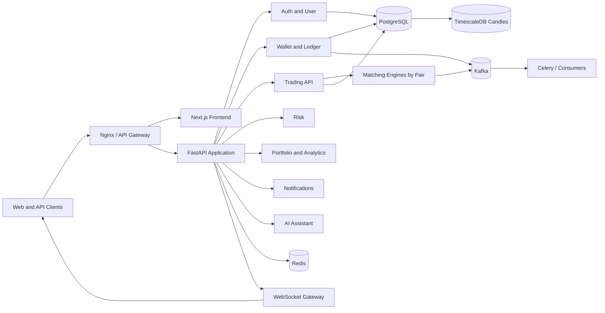
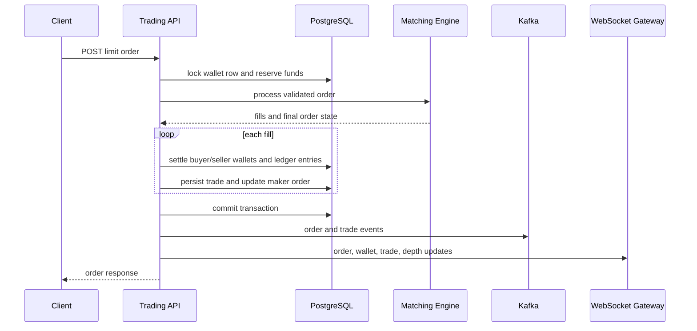
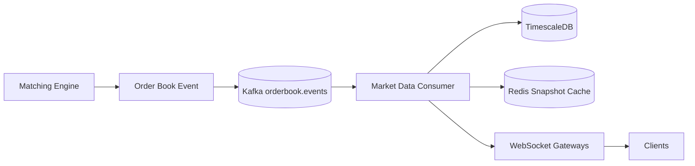
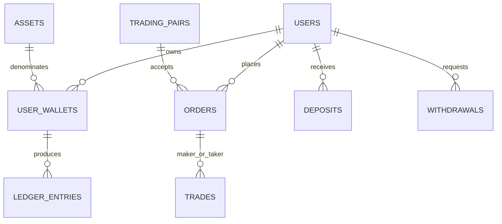

# TradeOff Exchange Architecture

## Product Definition

A centralized exchange is a custodian and marketplace that maintains user balances,
accepts orders, matches buyers and sellers, settles trades on an internal ledger, and
exposes market data. Users register, secure accounts with MFA, fund wallets, reserve
funds for orders, trade, withdraw, and review portfolio performance. Admins manage
assets, users, withdrawals, risk limits, and audit trails.

Supported workflows include authentication, profiles, wallets, deposits, withdrawals,
portfolio dashboards, spot market/limit/stop orders, order books, trades, candles,
notifications, admin operations, audit logs, analytics, favorites, referrals, copy
trading, AI-assisted explanations, risk controls, and leaderboards.

## Architecture Choice

| Style | Strength | Weakness | Decision |
|---|---|---|---|
| Monolith | Simple transactions | Tight coupling and poor scaling isolation | Reject |
| Modular monolith | Fast delivery and ACID boundaries | Shared deployment blast radius | Use initially |
| Microservices | Independent scaling and ownership | Distributed consistency cost | Evolve toward |
| Event driven | Decoupled consumers and replay | Ordering and operational complexity | Use for integration |

TradeOff uses a modular monolith with event-driven boundaries. The matching engine is
isolated per trading pair and is the first candidate for extraction. PostgreSQL remains
the financial system of record. Kafka carries durable domain events; Redis is never the
authoritative ledger.

## Service Boundaries

| Service | Owns | APIs | Events | Scaling and Failure Notes |
|---|---|---|---|---|
| Auth | users, sessions, API keys | register, login, refresh, MFA | user.login | Stateless replicas; revoke sessions on compromise |
| User | profiles, favorites, referrals | me, favorites, referrals | user.updated | Cache read-heavy profiles |
| Wallet | wallets, ledger, deposits, withdrawals | balances, withdraw | wallet.* | Serializes balance rows; never accept negative balances |
| Trading | orders and validation | market, limit, stop, cancel | order.* | Idempotent client order IDs required at scale |
| Matching | in-memory books | internal command stream | trade.*, orderbook.* | One writer per pair partition |
| Market Data | trades, candles, tickers | ticker, depth, candles | market.* | Fanout and TimescaleDB retention |
| Portfolio | holdings and valuation | summary, history, allocation | portfolio.updated | Eventual valuation, exact balances |
| Notification | inbox and delivery status | list, read | notification.* | At-least-once delivery |
| Analytics | aggregates | user analytics | analytics.raw | Batch/stream consumers |
| Admin | users, assets, withdrawals | suspend, activate | audit.* | RBAC and mandatory audit |
| Risk | user and market limits | limits | risk.* | Fail closed for trading |
| Copy Trading | leaders and follower controls | leaderboard, follow | copytrade.* | Never promise identical execution |
| AI | explanations and summaries | chat, analysis | ai.requested | No autonomous trading authority |
| Audit | immutable operator trail | admin reads | audit.* | Append-only, long retention |
| Search | assets, users, audit lookup | search | search.index | Elasticsearch is a projection |

## Trading and Settlement Flow

The current simulator performs matching in-process. A production extraction uses an
order command topic partitioned by pair, a single active engine per partition, a
write-ahead log, periodic snapshots, and deterministic replay. Database settlement is
idempotent by trade ID.

## Matching Engine

The book uses price-time priority: bids descend, asks ascend, and each price level is a
FIFO queue. Best-price access is O(1), price insertion is O(P) in the simulator because
prices use sorted arrays, and cancellation is O(N) within a level. Production should
replace arrays with a tree, skip list, or specialized price ladder and maintain an
order-ID index for O(1) cancellation.

Supported order behavior:

- Market orders execute immediately and cancel unfilled quantity.
- Limit orders cross at maker prices or rest on the book.
- IOC cancels remaining quantity after immediate execution.
- FOK performs a non-mutating liquidity preflight before execution.
- Stop-market and stop-limit orders remain off-book until trigger prices cross.
- Iceberg orders expose a peak and lose time priority when replenished.
- GTD orders require an expiry worker and reserve release.

Performance targets for an extracted engine: p99 command latency under 1 ms inside the
engine, 50k+ commands/second per hot pair, deterministic replay, and no shared mutable
state across pairs.

## Order Book and Realtime

Snapshots return `lastUpdateId`, bids, and asks. Incremental events must carry a strict
sequence. Clients load a snapshot, buffer increments, discard increments older than the
snapshot, and reconnect on gaps. Kafka retains durable order book events; Redis Pub/Sub
or a dedicated fanout bus distributes ephemeral WebSocket updates.

## Wallet and Ledger

Wallets contain `available`, `locked`, and a version. Orders move funds from available
to locked before entering the engine. Settlement consumes locked funds and credits the
counterparty. Cancellation releases unused locked funds. Database constraints prevent
negative balances.

Ledger entries are append-only and reference a transaction ID plus order, trade,
deposit, or withdrawal. The simulator records user-side entries. A production double
entry ledger additionally has exchange liability, fee revenue, custody asset, and
clearing accounts; every transaction must balance debits and credits to zero.

## Financial Consistency

- ACID transactions cover reserve, settlement, order persistence, and ledger writes.
- Wallet rows use `SELECT FOR UPDATE` to serialize debits.
- Unique IDs make trade settlement and deposits idempotent.
- Exactly-once is achieved as an effect, not a transport promise: consume at least once,
  write idempotently, then commit offsets.
- PostgreSQL is authoritative; Kafka and Redis can be rebuilt.
- On engine crash, restore the latest snapshot and replay the ordered WAL.
- On settlement failure, halt the affected pair and reconcile before accepting orders.
- On Kafka failure, use a transactional outbox before acknowledging clients in the
  production design.

## Database Design

Primary tables: users, sessions, API keys, assets, trading pairs, wallets, ledger
entries, deposits, withdrawals, orders, trades, candles, notifications, audit logs,
risk limits, referrals, favorites, watchlists, and copy trading relations.

Important indexes and constraints:

- Unique wallet per `(user_id, asset_id)`.
- Non-negative wallet available and locked balances.
- Unique asset symbols, pair symbols, emails, referral codes, and deposit tx hashes.
- Orders indexed by user, pair, status, and creation time.
- Trades indexed by pair and timestamp.
- Candles form a TimescaleDB hypertable on time and pair.
- Large trades, orders, ledger, and audit tables are time partitioned.

Retention: raw market events 30 days, minute candles 2 years, daily candles indefinitely,
audit and financial ledger at least 7 years, with S3 archival and checksum validation.
Backups use RDS PITR, daily snapshots, cross-region copies, and quarterly restore drills.

## Redis and Kafka

Redis holds sessions, rate-limit counters, ticker caches, order book snapshots, and
ephemeral fanout. Use `allkeys-lfu` only for cache databases; session and rate-limit
databases must not silently evict. Redis outage degrades caches and fanout but never
changes balances.

Kafka topics include `orders`, `orders.wal`, `trades`, `trades.wal`,
`orderbook.events`, `wallet.events`, `wallet.settlements`, `notifications`,
`analytics.raw`, `audit.events`, and a dead-letter queue. Order and book topics are
partitioned by pair; wallet topics are partitioned by user. Consumers use bounded
retries, idempotent writes, and DLQ inspection.

## Security

JWT access tokens are short-lived; refresh tokens are rotated and stored hashed. MFA is
required for withdrawals and sensitive account changes. Admin endpoints require RBAC.
Secrets belong in AWS Secrets Manager, not environment files in production. Apply
WAF/DDoS protection, request signing for API keys, IP allowlists, withdrawal address
cooldowns, bot detection, device risk scoring, and immutable audit logs.

Key threats: credential stuffing, JWT theft, refresh replay, SQL injection, broken
object authorization, negative-balance races, withdrawal fraud, price manipulation,
self-trading, WebSocket abuse, dependency compromise, and operator misuse.

## Observability and SLOs

Prometheus scrapes API, order, trade, latency, and WebSocket metrics. Grafana visualizes
traffic and execution. Loki aggregates logs. OpenTelemetry traces API-to-database and
event-consumer flows.

Initial SLOs:

- API availability: 99.9%
- Auth and balance-read p99: under 300 ms
- Order acceptance p99: under 500 ms end to end
- WebSocket market-data lag p99: under 1 second
- Ledger reconciliation mismatch: zero

Critical alerts cover backend availability, elevated 5xx rate, high p99 latency, Kafka
consumer lag, database lock waits, negative-balance invariant violations, settlement
failures, and reconciliation mismatches.

## Deployment and Scale

Local development uses Docker Compose. Staging and production use separate AWS
accounts, private subnets, RDS PostgreSQL, ElastiCache Redis, MSK Kafka, S3 archives,
CloudWatch, Route53, TLS, and autoscaled stateless API/WebSocket nodes. Kubernetes,
Helm, and Istio become justified when independent service deployment and traffic policy
outweigh their operational cost.

Scaling plan:

- 1k users: one API, one WebSocket node, one database.
- 10k users: API replicas, Redis cache, read replicas, Kafka consumers.
- 100k users: extracted matching engines, WebSocket fleet, partitioned tables.
- 1M users: regional market-data edges, sharded wallet domains, multi-AZ Kafka,
  rigorous disaster recovery, and dedicated SRE ownership.

## Load Testing

Pytest covers engine and domain invariants. Playwright covers login, order entry, and
portfolio workflows. Locust drives public market reads and authenticated order flows.
Test steps are 1k, 10k, 100k, and 1M simulated users with explicit latency, error-rate,
consumer-lag, and database-lock thresholds. Financial correctness is verified after
every load run.

## AI and Copy Trading

The AI assistant receives read-only market and portfolio context, explains trades and
risk, and never places orders without an explicit user action. Prompt injection,
hallucination, stale data, and financial-advice risk require clear provenance and
disclaimers.

Copy trading records follower allocation, maximum position size, stop-loss percentage,
and active status. Replicated trades are new orders subject to liquidity, slippage,
risk checks, and available balance. Followers must not be promised the leader's fill.

## Roadmap and Implementation Order

1. Foundations: schemas, migrations, compose, observability.
2. Auth and users: JWT, refresh rotation, MFA, RBAC.
3. Wallets: reservation, ledger, deposits, withdrawals, reconciliation.
4. Trading: validation, idempotency, order lifecycle.
5. Matching: deterministic engine, WAL, snapshots, recovery.
6. Market data: depth, trades, candles, realtime fanout.
7. Portfolio and analytics.
8. Risk, admin, audit, and fraud controls.
9. Copy trading and notifications.
10. AI explanations.
11. AWS deployment, load testing, and disaster recovery.

Critical path: financial schema -> wallet invariants -> order reservation -> matching ->
settlement -> reconciliation -> realtime projection. Frontend, analytics, search, and
AI can proceed in parallel after stable contracts exist.

## Architecture Review

Top bottlenecks and scaling challenges include hot BTC pair partitions, sorted-array
book insertion, database wallet row contention, synchronous settlement, WebSocket
fanout, Kafka consumer lag, candle aggregation, large audit tables, portfolio valuation,
and cross-region latency.

Top risks include ledger imbalance, duplicate settlement, engine/database divergence,
insufficient reserve release, FOK rollback errors, stale order book sequences,
withdrawal fraud, compromised admin accounts, leaked secrets, refresh-token replay,
dependency vulnerabilities, Kafka outage, Redis eviction, database failover, missing
reconciliation, copy-trade slippage, AI hallucination, poor disaster recovery, and
unbounded operational complexity.

Recommended improvements before real-money use:

1. Add a true balanced chart-of-accounts ledger and continuous reconciliation.
2. Move order commands to a durable pair-partitioned WAL and deterministic engine.
3. Add a transactional outbox for database-to-Kafka publication.
4. Enforce client-order idempotency and settlement idempotency constraints.
5. Extract custody, withdrawal approval, risk, and admin planes.
6. Add HSM/KMS-backed secrets, WAF, SIEM, and independent security review.
7. Replace in-process WebSocket fanout with Redis/NATS/Kafka-backed gateways.
8. Run chaos, failover, restore, and high-contention financial tests.
